<div align="center">
    <h1 style="margin-bottom: 0;">Kosmora 📂</h1>
    <p style="font-weight: bold">A Virtual File System for Game Assets</p>
    
    <br>
    
</div>

---

Kosmora provides a virtualized file system for game assets to be stored within, allowing for improved performance, more efficent memory usage, and a smaller storage footprint.

---

## Documentation

### Overview

Kosmora is a specialized virtual file system (VFS) designed for game development, enabling developers to efficiently manage, load, and access game assets. By abstracting the underlying file system, Kosmora provides a unified interface regardless of where files are physically stored.

### Architecture

```mermaid
graph TD
    subgraph VFS["Kosmora Virtual Filesystem"]
        VRoot["/"] --> VAudio["/audio/"]
        VRoot --> VTextures["/textures/"]
        VRoot --> VOther["/.../"]
    end
    
    subgraph RFS1["Real Filesystem 1"]
        R1["/path/to/your/game/assets/"] --> R1Packages["packages/"]
        R1Packages --> R1Audio["my_audio.kpkg"]
        R1Packages --> R1Other["other_assets/"]
        R1Other --> R1Files["..."]
    end
    
    subgraph RFS2["Real Filesystem 2"]
        R2["/another/location/for/packages/"] --> R2Files["..."]
    end
    
    subgraph RFS3["Real Filesystem 3"]
        R3["/home/user/game_data/"] --> R3Textures["game_textures.kpkg"]
        R3 --> R3Other["..."]
    end
    
    %% Mount Point Mappings
    VAudio -- "Mount Point Mapping" --> R1Audio
    VTextures -- "Mount Point Mapping" --> R3Textures
    
    %% Add styling
    classDef vfs fill:#445544,stroke:#333,stroke-width:2px;
    classDef realfs fill:#112233,stroke:#333,stroke-width:1px;
    classDef mountpoint fill:#337733,stroke:#333,stroke-width:1px;
    
    class VFS vfs;
    class RFS1,RFS2,RFS3 realfs;
    class VAudio,VTextures mountpoint;
    class R1Audio,R3Textures mountpoint;
```



### Core Components

1. **Virtual Path System** - Provides normalized path handling across all platforms
2. **Mount Registry** - Manages mount points and their mappings to physical locations
3. **Asset Loaders** - Type-specific handlers for loading different asset formats
4. **Package System** - Tools for creating and accessing compressed asset packages (.kpkg files)
5. **Memory Management** - Intelligent caching and memory optimization for loaded assets

### Key Features

#### Unified Access Layer

Kosmora presents a single, consistent interface for accessing game assets regardless of their physical location. This simplifies development by eliminating the need to manage multiple file paths or storage systems.

#### Asset Packaging

The `.kpkg` format allows developers to bundle related assets together, reducing file count and improving load times. These packages can be mounted directly into the virtual filesystem, providing transparent access to their contents.

#### Hot-Reloading Support

Assets can be monitored for changes and automatically reloaded during development, streamlining the iteration process without requiring game restarts.

#### Cross-Platform Compatibility

Kosmora handles platform-specific path differences, ensuring your game's asset loading code works consistently across Windows, macOS, Linux, and more.

#### Memory-Mapped I/O

For supported platforms, Kosmora can use memory-mapped I/O to improve loading performance and reduce memory fragmentation.

#### Asynchronous Loading

Built-in support for async loading operations allows games to load assets in the background without blocking the main thread.

### Installation

Add Kosmora to your `Cargo.toml`:

```toml
[dependencies]
kosmora = "0.1.0"
```

## Simple Example

Here's a basic example of setting up Kosmora and working with the virtual filesystem:

```rust
use kosmora::{Kosmora, MountOptions};
use std::path::Path;

fn main() -> Result<(), Box<dyn std::error::Error>> {
    // Initialize the VFS
    let mut vfs = Kosmora::new();
    
    // Mount a directory to the root of the VFS
    vfs.mount("/", Path::new("./assets"), MountOptions::default())?;
    
    // Mount a package file to a specific path
    vfs.mount_package("/audio", Path::new("./assets/audio_pack.kpkg"), MountOptions::default())?;
    
    // Read a file from the VFS
    let texture_data = vfs.read_file("/textures/player.png")?;
    println!("Loaded texture: {} bytes", texture_data.len());
    
    // List all files in a directory
    let audio_files = vfs.list_directory("/audio")?;
    println!("Audio files:");
    for file in audio_files {
        println!("  - {}", file.path());
    }
    
    // Check if a file exists
    if vfs.file_exists("/config/settings.json") {
        println!("Settings file found!");
    } else {
        println!("Settings file not found!");
    }
    
    Ok(())
}
```

### Creating and Using Packages

```rust
use kosmora::{PackageBuilder, CompressionLevel};

fn create_audio_package() -> Result<(), Box<dyn std::error::Error>> {
    // Create a new package builder
    let mut builder = PackageBuilder::new();
    
    // Add files and directories to the package
    builder.add_file("music/theme.ogg", "assets/music/main_theme.ogg")?;
    builder.add_directory("sfx", "assets/sounds")?;
    
    // Set compression level
    builder.set_compression(CompressionLevel::Best);
    
    // Build the package
    builder.build("audio_pack.kpkg")?;
    
    println!("Audio package created successfully!");
    Ok(())
}
```

### Advanced Usage: Asynchronous Loading

```rust
use kosmora::{Kosmora, AsyncLoadHandle};
use std::path::Path;

async fn load_game_assets(vfs: &Kosmora) -> Result<(), Box<dyn std::error::Error>> {
    // Start loading several assets asynchronously
    let texture_handle: AsyncLoadHandle<TextureAsset> = 
        vfs.load_async("/textures/character.png").await?;
    
    let audio_handle: AsyncLoadHandle<AudioAsset> = 
        vfs.load_async("/audio/music/battle.ogg").await?;
    
    // Do other initialization work while assets load
    initialize_game_systems();
    
    // Wait for all assets to complete loading
    let texture = texture_handle.await?;
    let audio = audio_handle.await?;
    
    // Use the loaded assets
    game_state.set_player_texture(texture);
    audio_system.play_music(audio);
    
    Ok(())
}
```

### Memory Management

```rust
use kosmora::{Kosmora, CachePolicy};

fn configure_memory_usage(vfs: &mut Kosmora) {
    // Set global cache size limit
    vfs.set_cache_size_limit(512 * 1024 * 1024); // 512 MB
    
    // Configure cache policies for different asset types
    vfs.set_cache_policy("/textures", CachePolicy::LRU);
    vfs.set_cache_policy("/audio/music", CachePolicy::Preload);
    vfs.set_cache_policy("/audio/sfx", CachePolicy::OnDemand);
    
    // Manually preload critical assets
    vfs.preload("/textures/ui");
}
```

### Working with Watch Paths for Hot Reloading

```rust
use kosmora::{Kosmora, WatchOptions};
use std::time::Duration;

fn setup_hot_reloading(vfs: &mut Kosmora) -> Result<(), Box<dyn std::error::Error>> {
    // Watch a directory for changes
    vfs.watch("/shaders", WatchOptions {
        recursive: true,
        delay: Duration::from_millis(100),
        on_change: Some(Box::new(|path| {
            println!("Shader changed: {}", path);
            reload_shader(path);
        })),
    })?;
    
    Ok(())
}
```

## License

Kosmora uses the BSD-3 Clause license, meaning that you are free to modify, distribute, and include Kosmora in your projects open-source or not.  

## Contributing

Contributions are welcome! Please see [CONTRIBUTING.md](CONTRIBUTING.md) for guidelines.

## Credits

Developed with ❤️ by Lily, Caz, and Kosmora contributors.
